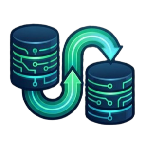

# ⚡ Supabase Migrator Pro

<div align="center">
  
  <h3>The Ultimate Enterprise-Grade Synchronization Engine for Supabase</h3>
  <p><i>Effortlessly mirror databases, storage, edge functions, and settings between any two Supabase projects.</i></p>
</div>

---

## 🚀 Overview

**Supabase Migrator Pro** is a high-performance, full-stack migration suite designed for developers and DevOps teams who need to move projects across regions, environments (Dev → Prod), or organizations with zero friction. It automates the complex dance of mapping schemas, migrating binary storage, and deploying edge functions, all while providing a **Live Terminal Stream** for absolute visibility.

### 💎 Key Features

- **🛡️ Triple-Shield Connectivity Strategy:** Our engine ensures 100% reachability regardless of manual configuration errors.
    1. **Smart Discovery:** Uses the Supabase Management API to fetch official database pooler hosts.
    2. **Universal Routing:** Leverages region-agnostic global proxies.
    3. **Direct Socket Fallback:** Bypasses poolers for direct Port 5432 communication.
- **📡 Live Terminal Stream:** Real-time logging of `pg_dump` and `psql` operations with on-the-fly security redaction.
- **📦 Full-Stack Sync:** 
  - **Database:** Roles, Schema, and Data with `session_replication_role` bypass for complex foreign keys.
  - **Storage:** Recursive bucket and file synchronization using high-speed streaming.
  - **Auth:** Migrates user identities and project authentication settings.
  - **Edge Functions:** Automatic deployment of local Deno functions to the target instance.
- **✨ Premium UI:** A glassmorphism-inspired dashboard built with Next.js and Tailwind CSS, featuring a celebratory success dashboard.

---

## 🛠️ Technical Stack

- **Frontend:** Next.js 14 (App Router), TypeScript, Tailwind CSS, Lucide Icons.
- **Backend:** Node.js Runtime, Child Process Spawning, Server-Sent Events (SSE).
- **Core Engine:** PostgreSQL Client Tools (`pg_dump`, `psql`), Supabase Management API.
- **Design:** Radix UI / Shadcn UI components.

---

## 💻 Getting Started

### Prerequisites

- Node.js 18+
- [Supabase CLI](https://supabase.com/docs/guides/cli)
- PostgreSQL Client Tools installed locally (`pg_dump`, `psql`)

### Installation

1. **Clone the repository:**
   ```bash
   git clone https://github.com/DG10-Agency/Complete-Supabase-One-Click-Migration-by-DG10.Agency.git
   cd supabase-migrator
   ```

2. **Install dependencies:**
   ```bash
   npm install
   ```

3. **Run the development server:**
   ```bash
   npm run dev
   ```

4. **Access the dashboard:**
   Open [http://localhost:3000](http://localhost:3000) in your browser.

---

## 🏢 Powered by DG10.Agency

This project is specialized and maintained by the engineering team at **DG10.Agency**. 

At **DG10.Agency**, we don't just build software; we architect experiences. We specialize in high-stakes migrations, enterprise-grade AI integrations, and world-class product design. If you need dedicated support for your Supabase infrastructure or are looking for a partner to scale your next big idea visit us at **[dg10.agency](https://dg10.agency)**.

---

## 📄 License

This project is licensed under the MIT License - see the [LICENSE](LICENSE) file for details.

---

<div align="center">
  <p>Built with ❤️ for the Supabase Community by DG10.Agency</p>
</div>
